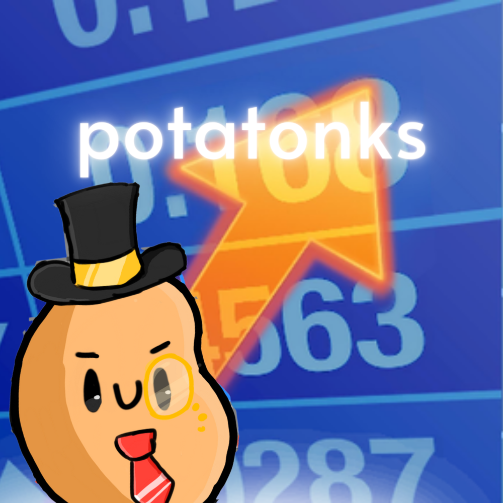

# potatwo industries

This is a Potato Industries reboot.
## Backstory
So Nick the Potato created Potato Cat, which was his all purpose Discord bot for whatever you might expect. Moderation, miscellaneous, and after, economy commands.

But apparently he got tired of Potato Cat and decided to make a new bot. Potato Industries.

Potato Industries is a bot that basically does Potato Cat's job, but with more of an economy aspect. It was cleaner (as much as you can do in discord.py) and had more commands. Many (and I mean many) people used it, and it was a success. It currently is in 97 servers.

At a certain point, Nick, Christina, and I made a planning Google Doc for the project. It was really ambitious, and we ended up not really finishing everything. 

Well, guess what this is.

**A rewrite of Potato Industries.**

In Discord.js. 

Hence, Potato Industries is now PotaTwo Industries.

## TODO
( what a long todo list )
### Potato Industries Rewrite
#### Basic framework
- [ ] Create message command handler and parser
- [ ] Create interaction command handler and parser
- [ ] Utility functions for parsing hex colors, etc.
- [ ] Database
#### Info Commands
( in no particular order )
- [ ] help
- [ ] ping
- [ ] invite
- [ ] about
- [ ] stats
- [ ] github
- [ ] support
- [ ] website
- [ ] vote
#### Economy Commands
( in no particular order )
- [ ] balance
- [ ] farm
- [ ] dig
- [ ] rob
- [ ] sabotage
- [ ] give
- [ ] beg
- [ ] shop
- [ ] buy
- [ ] sell
- [ ] shed
- [ ] bank
- [ ] deposit
- [ ] withdraw
- [ ] trade
- [ ] coinflip
- [ ] gamble
- [ ] passive
- [ ] use
#### Moderation Commands
( in no particular order )
- [ ] kick
- [ ] ban
- [ ] jail
- [ ] unjail
- [ ] setprefix
- [ ] roleall
#### Misc Commands
( in no particular order )
- [ ] say
- [ ] customembed
- [ ] sudo
#### Owner Commands
( in no particular order )
- [ ] eval
- [ ] setpotatoes
- [ ] blacklist
- [ ] unblacklist
### Additional features
#### Potato Teams
- [ ] Red Team
- [ ] Yellow Team
- [ ] Brown Team
- [ ] Purple Team
#### Other
- [ ] Events
- [ ] Shop Items
- [ ] Auction House

(Missing commands? Please let me know!)

## Contributors
* [Nick The Potato](https://www.youtube.com/c/NickThePotato) - original Potato Cat and Potato Industries code
* [Christina](https://www.youtube.com/channel/UCyqxWSc76QZsFoy9VZv0U8A) - crucial ideas, bot avatar, and encouragement
* [ThunderRedStar](https://github.com/thunder-red-star) - blacklisting commands + utility functions

## Other credits
* bobjoebilly - ideas and criticism, when we needed it
* all the rest of the community - for their support, and for their patience

## Contact
You can contact me by email (thunder@lmfa.ooo), Discord (ThunderRedStar#5969), or GitHub (thunder-red-star).

## License
This project is licensed under the MIT license.